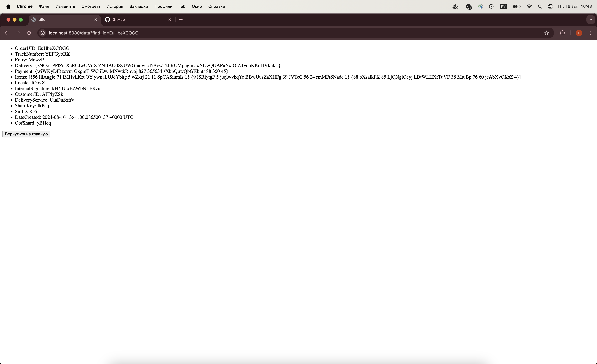

# L0

Запустить докер командой

docker-compose up --build -d

сервер будет находиться на локалхост 8080
http://localhost:8080/

Для входа в бд необходимо открыть контейнер с бд и в терминалле ввести:

psql -U kate -d l0

После того как вы войдете в своего пользователя введите:

select id from orders;

Далее вводим id в окошко:  

Нажимая "Получить данные", получаем данные о заказе:

